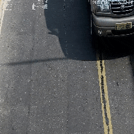
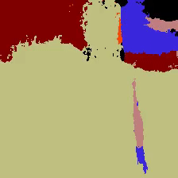
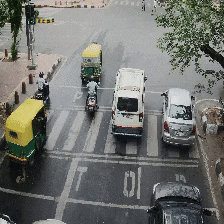
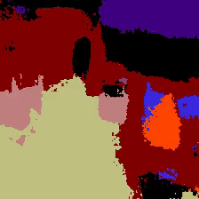
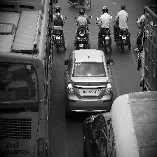
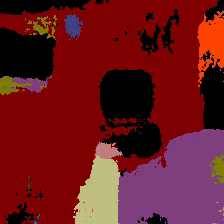

## Demo
# 1.   2.   
# 3. 

## Building Docker image  
    sudo docker build -t  saytosid/segnet_demo:latest .

## Running a container with this image

    docker run -it --device /dev/video0 -v <ABSOLUTE PATH TO YOUR OUTPUT DIRECTORY>:/workspace/out -v <ABSOLUTE PATH TO YOUR INPUR DIRECTORY>:/workspace/in saytosid/segnet_demo
## Running segnet  
    ./segnet.sh  
This will run segnet on .jpg images of your <INPUT_DIRECTORY> and produce outputs in your <OUTPUT_DIRECTORY>    
    

### Note:
    The code is present in segnet_demo.py and is quite straight forward. If you change the code then you need to rebuild the docker image.

## Based on 
    SegNet: A Deep Convolutional Encoder-Decoder Architecture for Robust Semantic Pixel-Wise Labelling 
For more details on the project please refer to the [Segnet website](http://mi.eng.cam.ac.uk/projects/segnet/ )  
The docker image is based on [aospan's docker-segnet image](https://hub.docker.com/r/aospan/docker-segnet/)

